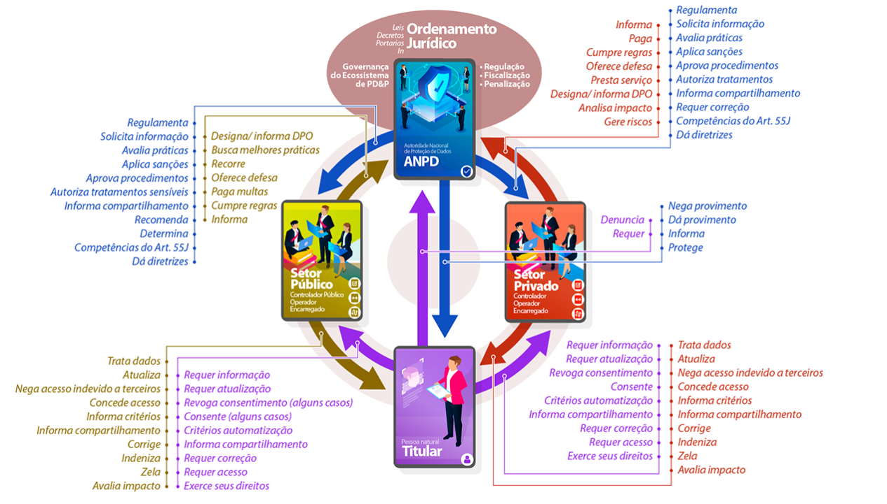

# Fundamentos da LGPD

Essas são notas feitas a partir do curso  Fundamentos da LGPD, disponível em https://www.escolavirtual.gov.br/curso/603

## Conceitos básicos

### o que é
* LGPD regulamenta o tratamento de dados pessoais
  * objetivos: proteger a liberdade, privacidade, intimidade e o livre desenvolvimento da personalidade da pessoa natural, ou seja, o titular dos dados
  * mas também garantir o adequado fluxo de dados, o direito à informação, à liberdade de expressão
  * prenitude e a saúde da economia digital e informacional

### a quem se aplica

* a qualquer operação de tratamento de dados realizada por pessoa natural ou física, por empresa pública ou privada, com o objetivo de ofertar bens e serviços ou de fornecer o serviço de tratamento de dados em si
* não é apenas tratamento digital
  * esta lei dispõe sobre o tratamento de dados pessoas, inclusive nos meios digitais

### datas

* vigora desde agosto 2020
* sanções desde agosto de 2021

## conceitos e definições

* **dado pessoal**: qualquer informação que possa levar à identificação de uma pessoa natural (titular), como: nome, endereço, e-mail, identidade, CPF, dados de localização, endereço de IP do computador e outros.
* **dados pessoal sensível**: qualquer informação que possa causar impacto mais relevante na vida pessoal e/ou profissional, caso seja exposta ou compartilhada, tais como: dado de origem racial ou étnica, convicção religiosa, opinião política, filiação a sindicato ou organização de caráter religioso, filosófico ou político, dado referente à saúde, à vida ou orientação sexual, dado genético ou biométrico
* **tratamento de dados**: o tratamento abrange um amplo conjunto de operações efetuadas sobre dados pessais, por meios manuais ou automatizados. Inclui: coleta, registro, organização, alteração, consulta, utilização, divulgação, bloqueio, destruição.

* atores
  * titular: é a pessoa natural, o ser humano a quem se referem os dados pessoais que são objeto de tratamento, seja criança, adulto ou idoso
  * controlador: pessoal natural ou jurídica responsável pelo tratamento dos dados pessoais, que deve definir a hipótese legal, a finalidade e o modo como esses dados serão tratados por ele mesmo ou por quem ele designar para fazer esse tratamento. (No regulamento europeu, o controlador é chamado "responsável")
  * operador: pessoa jurídica (em geral) ou pessoa natural/física, que realiza o tratamento de dados pessoais em nome do controlador. É possível que um controlador seja ao mesmo tempo o operador responsável pela execução do tratamento. (Em leis EUA e UE, operador é chamado de processador)
  * agente de tratamento: controlador e operador são agentes de tratamento
  * encarregado: **é o DPO (data protection officer)**, é uma pessoa natural indicada pelo controlador ou pelo operador para ser a ponte entre esses agentes de tratamento e os titulares dos dados, e também entre os agentes de tratamento e a ANPD. O encarregado também é responsável por orientar os funcionários do controlador sobre as práticas de tratamento de dados.
  * ANPD: autoridade nacional de proteção de dados, orgão da adminsitração pública responsável por zelar, implementar e fiscalizar o cumprimento dos dispositivos e a aplicação dos princípios e fundamentos da LGPD. Também é a instância responsável pela aplicação das sanções previstas na LGPD.

## direitos do titular

O titular dos dados é o protagonista da LGPD. Nesse sentido a LGPD define o regramento sobre como os agentes de tratamento podem obter, separar, classificar ou trabalhar os dados pessoais de alguém para ofertar ou entregar serviços e produtos que pretendam melhorar a vida dessa pessoa ou da sociedade como um todo.

Ou seja, a LGPD determina um domínio dos dados, os quais estão vinculados à pessoa. E os agentes de tratamento interagem com esse domínio (obter, separar, classificar, trabalhar) com algum finalidade (ofertar ou entregar serviços/produtos que melhorem a vida da pessoa ou da sociedade)

### 10 bases legais para o tratamento de dados pessoais

São 10 bases legais, pelas quais o tratamento de dados pessoais é possível. Fora delas, torna-se ilegal e implica violação de dados. Essas bases estão vinculadas aos direitos do titular.

Sendo assim, os direitos do titular devem ser atendidos pelo controlador. Ele precisa definir os requisitos por meio dos quais esses direitos serão cumpridos, sempre que necessário, com simplicidade, rapidez e qualidade.

1. solicitar anonimização (usar meios técnicos razoáveis e disponíveis no momento do tratamento, de forma que um dado pessoal não possa ser associado direta ou indiretamente a um indivíduo, tornando-o anônimo.) dos seus dados, quando eles forem coletador de forma desnecessária, excessiva, ou em desconformidade com a LGPD, além de pedir, em determinados casos, o bloqueio ou a eliminação desses dados tratados em desacordo com a lei (decorrência do direito ao esquecimento). (Art. 18, IV)
2. receber confirmação sobre tratamento de seus dados e ser informado sobre seus dados (Art. 18, I)
3. ter acesso ao conjunto de informações sobre o tratamento de seus dados, inclusive no tocante a finalidade, modo, identificação do controlador, uso compartilhado de seus dados, responsabilidade dos agentes (Arts. 9, 18, II)
4. solicitar correção ou atualização dos seus dados, como atributo de qualidade no tratamento dos dados pessoais (Art. 18, III)
5. Revogar consentimento para a coleta ou tratamento de dados, quando a abse legal de tratamento for o consentimento (Art. 18, IX)
6. Obter informação das entidades públicas e privadas com as quais o controlador realizou uso compartilhado de dados (Art. 18, VII)
7. Opor-se a qualquer tratamento fundado em alguma das hipóteses de tratamento diversas do consentimento quando haja violação do dispoto na lei (Art. 18, &2)
8. ser informado sobre a possibilidade de não fornecer consentimento para tratamento de seus dados e as consequências dessa negativa (Art. 18, VIII)
9. requerer revisão de decisões tomadas unicamente em tratamento automatizado de dados pessoais, quando estas afetem seus interesses (Art. 20)
10. peticionar as controlador para o exercício de seus direitos ou peticionar à Autoridade Nacional de Proteção de Dados (Art. 18, &1)

De qualquer forma, é importante ter em mente que, para a LGPD, **violar dados não é apenas invadir um repositório ou vazar dados pessoais**. **Qualquer desconformidade com a Lei, inclusive a indisponibilidade de dados que deveriam ser acessíveis, implica "violação de dados"**. 

### O sentido do consentimento pelo Titular

A narrativa da LGPD como a lei do consentimento ganhou foros inadequados de protagonismo. **E não é verdade que os nossos dados somente serão tratados se dermos nosso consentimento**. Eles podem ser tratados se a lei dispuser nesse sentido, se nós firmamos um contrato com alguém, ou se houver legítimo interesse entre um prestador de serviços e um tomador desses serviços. **Se o consentimento fosse tão importante, não haveria nove outras possibilidades de tratamento e elas não precederiam, na verdade, na inteligência do tratamento de dados, ao consentimento**. O que a lei traz de importante não é o consentimento, **mas os direitos que o titular detém**, **independentemente de lhe ter sido pedido ou não um consentimento para tratar aqueles dados**. Independentemente da base legal que seja adotada, o titular tem um conjunto de direitos que precisam ser respeitados e é isso que é importante na lei e na modificação que ela trouxe para o ordenamento jurídico atual.

## relações e atribuições

### competências da ANPD

A ANPD não tem apenas a função de fiscalizar e punir. A Autoridade Nacional de Proteção de Dados tem a responsabilidade de 
* zelar pela proteção de dados, 
* elaborar diretrizes para a Política Nacional de Proteção de Dados, 
* apreciar e processar petições dos titulares, 
* disseminar o conhecimento sobre privacidade para o grande público, 
* realizar estudos sobre as práticas de privacidade no Brasil e no mundo, 
* desenvovler formas simplificadas para o registro de reclamações sobre o tratamento de dados pessoais.
* articular-se com as autoridades reguladoras públicas para exercer suas competências em setores específicos de atividades econômicas e governamentais sujeitas à regulação. Essa  articulação deverá se dar com os PROCONS, com as Agências Reguladoras, com as associações de defesa dos consumidores em seus diversos setores de atividade.

## tratamento de dados

### processos de tratamento

Tratamento é toda operação realizada com dados pessoais, como as que se referem a:

* acesso: possibilidade de comunicar-se com um dispositivo, meio de armazenamento, unidade de rede, memória, registro, arquivo, ou outros, visando receber, fornecer, ou eliminar dados
* armazenamento: ação ou resultado de manter ou conservar em repositório um dados
* arquivamento: ato ou efeito de manter registrado um dado, embora já tenha perdido a validade ou esgotada a sua vigência
* avaliação: ato ou efeito de calcular valor sobre um ou mais dados
* classificação: maneira de ordenar os dados conforme algum critério estabelecido
* coleta: recolhimento de dados com finalidade específica
* compartilhamento: comunicação, difusão, transferência internacional, interconexão de dados, pessoais por orgãos e entidades públicas no cumprimento de suas competências legais, ou entre esses e entes privados, reciprovamente, com autorização específica, para uma ou mais modalidades de tratamento permitidas por esses entes públicos, ou entre entes privados
* comunicação: transmitir informações pertinentes às políticas de ação sobre os dados
* controle: ação ou poder de regular, determinar ou monitorar as ações sobre o dados
* difusão: ato ou efeito de divulgação, propagação, multiplicação dos dados
* distrubuição: ato ou efeito de dispor de dados de acordo com algum critério estabeleecido
* eliminação: ato ou efeito de excluir ou destruir dado do repositório
* extração: ato de copiar ou retirar dados do repositório em que se encontrava
* modificação: ato ou efeito de alteração do dado
* processamento: ato ou efeito de processar dados
* produção: criação de bens e de serviços a partir do tratamento de dados
* recepção: ato de receber os dados ao final da transmissão
* reprodução: cópia de dado preexistente obtido por meio de qualquer processo
* transferência: mudança de dados de uma área de armazenamento para outra, ou para terceiro
* transmissão: movimentação de dados entre dois pontos por meio de dispositivos elétricos, eletrônicos, telegráficos, telefônicos, radioelétricos, pneumáticos
* utilização: ato ou efeito do aproveitamento dos dados entre outras

As atividades de tratamento de dados pessoais também devem observar os seguintes princípios (Art. 6)

* finalidade: o tratamento deve ser realizado para propósitos legítimos, específicos, explícitos e informados ao titular
* adequação: o tratamento deve ser compatível com as finalidades informadas ao titular
* necessidade: o tratamento deve estar limitado ao mínimo necessário para a realização das finalidades a que se destina
* livre acesso: garantir aos titulares, a consulta facilitada e gratuita sobre a forma e a duração do tratemento e à integralidade de seus dados pessoais
* qualidade dos dados: garantir aos titulares exatidão, clareza, relevância e atualização dos dados
* transparência: garantir aos titulares informações claras, precisas e facilmente acessíveis sobre a realização do tratamento e os respectivos agentes de tratamento
* segurança: utilizar medidas técncas e administrativas para proteção dos dados pessoais de acessos não autorizados e de situações acidentais ou ilícitas que resultem na sua destruição, perda, alteração, comunicação ou difusão
* prevensão: adotar medidas para prevenir a ocorrência de danos em virtude do tratamento de dados pessoais
* não discriminação: impossibilitar a realização do tratamento de dados para fins discriminatórios, ilícitos ou abusivos
* responsabilização e prestação de contas: o agente de tratamento deve demonstrar que adotou medidas eficazes e capazes de cumprir as normas de proteção de dados pessoais.

### situações previstas na lei

O que a Lei garante, em qualquer dessas hipóteses, é o equilíbrio entre a proteção de dados e a privacidade: seu objetivo é proteger a privacidade e, ao mesmo tempo, garantir o adequado fluxo de dados e informações, em proveito tanto do titular quanto do mercado e da economia digital. 

Cada base legal de tratamento de dados pessoais será identificada pelo Controlador de acordo com a conveniência e a conformidade entre a finalidade do tratamento e os princípios gerais da Lei presentes em cada uma das hipóteses nela prescritas, apresentadas a seguir.

#### hipóteses de tratamento permitidas

1. cumprimento de obrigação legal
   * se há uma previsão legal ou regulamentar no snetido de que os dados sejam tratados, essa base legal é bastante para que o controlador esteja coberto na execução do tratamento.
   * exemplos: entrega anual da declaração IRPF; recadastramento eleitoral com biometria; informação de doença infecto-contagiosa;
2. execução de políticas públicas
   * o gestor público pode tratar e fazer uso compartilhado de Dados Pessoais para execução de Políticas Públicas. A Execução dessas políticas em prol do bem comum exige, frequentemente, o tratamento compartilhado de dados pessoais.
   * exemplos: tratamento de dados para execução de política de distribuição de renda (bolsa família); tratamento de dados para erradicação do analfabetismo; tratamento de dados para aumento da segurança alimentar; tratamento de dados para melhoria do ambiente de negócios.
3. realização de estudos por orgãos de pesquisa
   * esses estudos, como censo populacional, PIB, renda per capita, nível de distribuição de renda, mapa da fome, nível de alfabetização e comportamento do sistema educacional são fundamentais para o crescimento do país. E deve ser garantido, sempre que possível, que os dados pessoais permaneçam anônimos.
   * Exemplos: censo realizado pelo IBGE; informação ao IPEA; saúde pública e doenças tropicais
4. execução de contrato
   * o simples ato de contratar já traz em si a vontade de materializar o registro dos dados das partes no instrumento contratual, para o conhecimnento recíproco, pelo menos. E se o objeto do contrato for o tratamento de dados do titular, ou tiver esse tratamento como consequência do objeto, a evidente manifestação de vontade que existe se materializa neste instrumento particular válido firmado entre duas pessoas, e é a base legal para o tratamento de dados pessoais.
   * exemplo: contrato de aluguel; locação de veículo;
5. exercício regular de direitos
   * essa hipótese legal confere legitimidade ao uso que os agentes de tratamento façam dos dados tratados para atuação em defesa de seus interesses perante autoridades em processos administrativos ou judiciais. A finalidade original do tratamento é uma (garantir a entrega e a contraprestação em um contrato, por exemplo). O uso para esta outra finalidade (defesa) encontra respaldo nessa base legal.
   * exemplo: um controlador utiliza os dados pessoais dos titulares para contestar uma ação judicial por violação, em caso de não integridade dos dados; um operador se utiliza dos dados para fazer prova em ação de reparação de danos por vazamento de informação pessoal.
6. proteção da vida
   * a base legal para o tratamento aqui é a proteção da vida do titular ou de terceiro. A privacidade de uma pessoa jmais será considerada um bem maior que a vida humana, sua ou de terceiros. Por essa razão, se alguem informa seus dados e circunstâncias (como tipo sanguíneo, numa circunstância de acidente), não está havendo "violação de dados".
   * exemplo: um médico manipula dados ou informações de um paciente para controle de quadro emergencial grave; alguém repassa o endereço de um suicida; alguém checa o histórico de vida pregressa de passageiros para identificar um terrorista em ataque.
7. tutela da saúde
   * essa hipótese trata dos procedimentos para proteção da saúde executados por profissionais do setor ou entidades sanitárias.
   * exemplos: tratamento de dados relacionado a lista de pessoas que tiveram contato com alguma infecção, com a finalidade de controle de pandemia; levantamento socioambiental de zonas afetadas por epidemia; perfil de habitantes de dada comunidade para fins de planejamento sanitário.
8. interesse legítimo
   * esta base legal dá suporte ao tratamento executado com legitimidade de interesse do Agente de Tratamento, do Titular ou de terceiros. A prestação de um serviço que dependa do tratamento de dados torna legítimo ao Agente de Tratamento tratar os dados pessoais. Mas a legitimidade desse interesse só prospera se ele se faz coerente com a leǵitima expectativa do titular ou de terceiro em relação à finalidade e aos modos de tratamento.
   * exemplos: o endocrinologista depende dos dados pessoais (inclusive sensíveis) do paciente para tratá-lo. o sudo desses dados para promover mail marlering de produtos de emagrecimento extrapola a legítima expectativa do titular; o serviço de heldesk depende dos dados do titular para lhe prestar atendimento e facilitar futuras demandas. O uso desses dados para comercializar cadastros a terceiros viola a legítima expectativa do titular; o cibercafé guarda os dados de seus usuários inclusive para segurança do interesse de terceiros, pelo prazo de um ano. A transferência dos registros de conexão a terceiros viola a legítima expectativa do titular.
9.  proteção ao crédito
    * o tratamento de dados para proteção ao crédito é escudado por esta base legal. As pendências obrigacionais, inadimplências e a má-conduta de pessoas naturais e jurídicas na praça são circunstâncias lesivas a toda a cadeia creditícia e contrárias aos interesses da sociedade como um todo.
    * exemplos: o serasa bloqueia usuários no uso de suas ferramentas de crédito; quando o controlador se vale do cadastro positivo; quando algúem contrata o serviço DataValid; quando alguém usa o aplicativo VIO.
10. consentimento
    * o agente (controlador ou operador) pode tratar a informação de uma pessoa se tiver seu consentimento para tanto. O consentimento, para o agente de tratamento, é uma base legal precária: pode ser revogada a qualquer momento, sendo garantido ao usuário o direito de ver seus dados eliminados, bloqueado, além do direito à portabilidade, que muito se ajusta a essa base legal.
    * exemplo: uma pessoa autoriza o uso do seu CPF numa rede de farmácias para fins exclusivos de concessão de desconto na compra de um medicamento; alguém preenche um cadastro numa loja para ter acesso a promoções.

### Consentimento x Consenso / Interesse Legítimo

**Um consentimento é uma atitude inequívoca em relação à determinada realidade**, emitida unilateralmente por parte de quem detém o direito a uma determinada informação. 
**Há consentimento** de toda ordem no mundo dos negócios, no mundo dos contatos. 
Já **o consenso é a anuência em formato bilateral a respeito de um dado objeto**, de ajuste entre as partes. 

Se você tem um contrato com alguém, você vai ter ali um conjunto de detalhamentos daquele ajuste. Todos devem saber que a execução de um contrato é uma das hipóteses de tratamento de dados pessoais em termos de LGPD. 
Estão no contrato, as obrigações entre as partes, os direitos de uma em face da outra, os detalhes sobre a execução, as penalidades decorrentes do descumprimento de determinadas obrigações, o tempo de duração, o modo como os dados vão ser tratados, todo esse conjunto de ajustes compõem o contrato. 
**E o consenso é um desses elementos**, porque o contrato não persiste se não houver uma vontade de parte a parte, formalizando aquele determinado ajuste. Essa é a diferença básica entre consenso e consentimento.

**O legítimo interesse** é a mais fluida e controvertida das bases legais de tratamento. Legítimo interesse é a base legal utilizável para aqueles casos em que ao menos um interesse legítimo esteja em evidência: o do agente de tratamento, o do titular ou de um terceiro.
**Legitimidade é uma palavra menos subjetiva do que parece**. Muita gente entende que essa é a dificuldade da base legal. Não, a legitimidade não é difícil de compreender: **sempre que um agente de tratamento pensar em sustentar a coleta dos dados que vai tratar - em nome do seu legítimo interesse - terá que verificar, acima de tudo, se esse legítimo interesse abriga, de alguma forma, a legítima expectativa do titular do outro lado**. 

Por exemplo, eu presto serviço de help desk e para prestar esse serviço preciso saber, digamos: nome, CPF, a cidade de residência do titular. São elementos necessários à prestação dos  serviços. Olhando pelo lado do titular, é razoável imaginar que a sua legítima expectativa comporte essa necessidade. **Mas se eu peço, além disso, renda, prole, padrão de consumo, endereço físico, não é razoável pensar que isso atenda ao legítimo interesse**. Parece mais, nesse caso, que nós temos aí uma outra finalidade obscura, desvalorizando então, o princípio da adequação, que é um princípio importante na
LGPD.

### dados pessoais sensívels

Dados pessoais sensíveis são sobre: 
* origem racial ou étnica, 
* convicção religiosa, 
* opiniãoo política, 
* filiação a sindicato ou a organização de caráter religioso, filosófico ou político, 
* dados referentes à saúde, à vida ou orientação sexual, 
* dados genéricos ou biométricos, quando vinculados a uma pessoa natural

Em geral: caso expostos ou compartilhados, pode causar impacto na vida pessoal ou profissional. A sensibilidade reside tanto no enorme potencial de lesividade desses dados, quanto no interesse que suscitam para os negócios.

São oito hipóteses previstas na lei:
1. mediante consentimento para finalidades específicas
2. cumprimento de obrigação legal ou regulatória pelo controlador
3. compartilhamento de dados necessários à execução de políticas públicas
4. realização de estudos por orgão de pesquisa, garantida, sempre que possível, que os dados pessoais permaneçam anônimos.
5. exercício regular de direitos
6. proteção da vida ou da integridade física do titular ou de terceiros.
7. tutela da saúde
8. garantia da prevenção à fraude e à segurança do titular

**As hipóteses de tratamento de Dados Sensíveis são mais restritas que a de Dados Pessoais, sendo excluídos "Execução de Contrato", "Interesse Legítimo" e "Proteção ao Crédito".**

A lei veda:
* pelas operadoras de planos privados de assistência á saúde o tratamento de dados de saúde para a prática de seleção de riscos na contratação de qualquer modalidade;
* pelos controladores de dados pessoais sensíveis referentes à saude é vedado o compartilhamento ou comunicação com o objetivo de obter vantagem econômica
  * exceto em serviços na área da saúde, assistência farmacêutica, assistência à saúde (diagnósticos e terapias), mas sempre em benefício dos titulares dos dados
    * a portabilidade de dados, quando solicitado pelo titular
    * as transações financeira e administrativas resultantes do uso e da pretação dos serviços de que trata este parágrafo.

#### Tratamento de dados pessoais sensíveis

Dados pessoais sensíveis são aqueles que ostentam maior carga de lesividade ou maior risco de dano ao direito do titular. Estão incluídos aqui as opções político-filosóficas, as opções políticas, sindicais, as filiações a ideais sindicais ou  políticas, as opções sexuais, a biometria, entre outros.

No caso dos dados pessoais sensíveis, o legislador foi mais arrojado em relação à proteção do titular. Em matéria de dados pessoais sensíveis, **há apenas duas hipóteses: o consentimento - e não havendo consentimento sete outras possibilidades, todas excepcionais, e quase todas essas sete possibilidades estão contidas entre as dez possibilidades de tratamento original**. 
Apenas a prevenção à fraude está presente somente aqui, nos dados sensíveis, mas as demais, as outras seis estão presentes entre aquelas 10 hipóteses de tratamento. Mas aqui sim, como uma exceção ao consentimento. Porque? Porque o dado pessoal sensível, como nós dissemos, tem uma carga maior de risco, uma possibilidade maior de lesividade aos direitos e aos interesses do titular.

#### dados de crianças e adolescentes

Há regimes diferentes para crianças e adolescentes.

Criança é a pessoa com idade de até doze anos incompletos, e adolescente é aquela entre doze e dezoito anos de idade (Estatuto da Criança e Adolescente, Art. 2º).

O tratamento de dados pessoais de crianças e adolescentes, naqueles casos em que **a base legal seja o consentimento**, deve ser realizado **com o consentimento específico e em destaque emitido por pelo menos um dos pais ou pelo responsável legal**. 

No tratamento de dados de crianças e adolescentes com fundamento **em outras bases legais**, **as restrições gerais do Estatuto e do Código Civil prevalecem em relação ao menor de idade**. Por exemplo: 

* Na execução de contrato o menor deve ser representado por seu responsável;
* Nos tratamentos por força de Lei devem ser respeitadas as condições específicas no tocante a menores; 
* No caso de legítimo interesse, a legítima expectativa a ser avaliada deve levar em conta o ponto de vista do representante do menor, enquanto tal.

A Lei, entretanto, traz exceção à regra acima mencionada, de forma que **os dados pessoais de crianças poderão ser eventualmente tratados sem o consentimento exigido pela lei quando necessário para contatar os pais ou responsáveis legais, a fim de garantir a proteção da criança ou adolescente**, desde que sejam utilizados **uma única vez e sem armazenamento**, e **em nenhum caso poderão ser repassados a terceiros**.

A participação desses Titulares (crianças e adolescentes) em jogos, aplicações de internet ou outras atividades também não deve ser condicionada ao fornecimento de informações pessoais além das estritamente necessárias à atividade.

Na hipótese de seus dados serem tratados com base em consentimento, esse consentimento deve ser o consentimento do pai ou do responsável pelo menor, basicamente isso. Há outras disposições legais, mas esse é o núcleo do capítulo específico de crianças e adolescentes na LGPD. 
Uma das críticas que faz a essa disposição é que a LGPD não diferenciou muito criança de adolescente. Ela tratou de forma plana a necessidade de consentimento paterno ou do representante legal, nas hipóteses de consentimento. 
Claro que as outras vão ser tratadas na sua especificidade: a execução de contrato, a representação do menor é aquela ordinária estabelecida no ECA - Estatuto da Criança e do Adolescente. 
Outra crítica que se faz é que a verificação da veracidade desse consentimento do responsável não ficou bem tratada na Lei, como ficou tratado no COPPA, que é a lei Norte Americana correspondente a essa disposição relativa a dados de menores. 
Na nossa Lei isso ficou tratado pelo critério do “razoável esforço” por parte de quem é obrigado a identificar se há esse consentimento paterno. 
Já os idosos não têm um tratamento diferenciado. A lei apenas prevê - e a ANPD tem entre suas atribuições - garantir que o tratamento desses dados de idosos seja efetuado de maneira simples, clara, acessível e adequada a sua compreensão.

### Compartilhamento e transferência de dados

